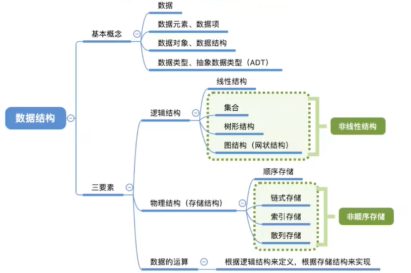
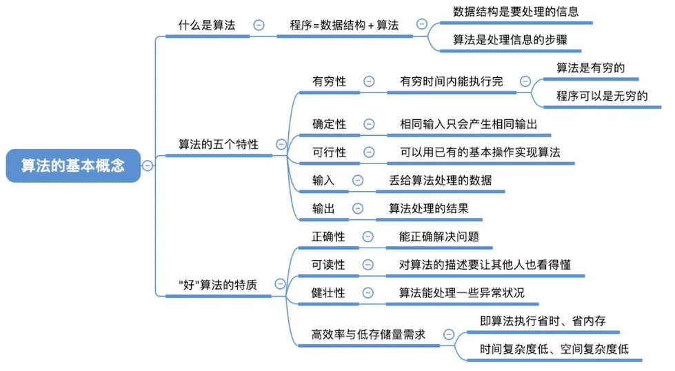
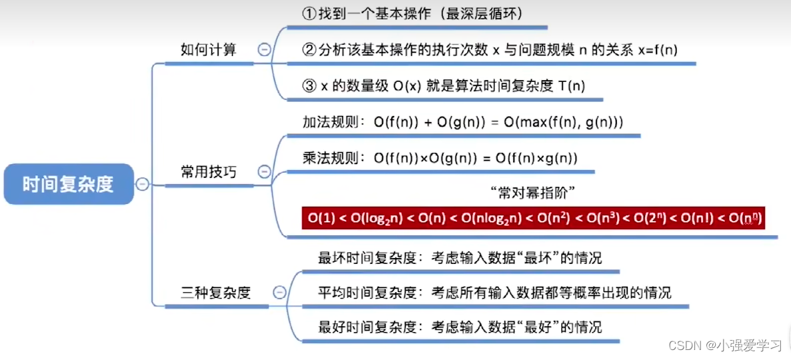
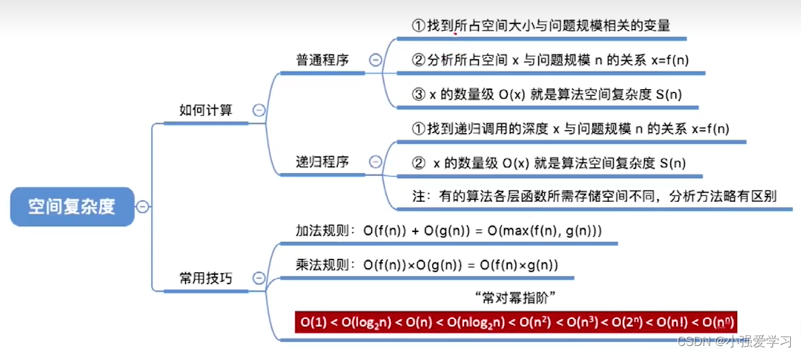

### 1.1 数据结构的基本概念

***1.数据：***数据是信息的载体，符号的集合、所有能输入到计算机中并能被计算机程序处理的符号的集合，数据是计算机程序加工的原料。

***2.数据元素：***数据的基本单位，通常作为一个整体进行考虑和处理。一个数据元素可由若干数据项组成。

***3.数据项：***构成数据元素的不可分割的最小单位。

***4.数据对象：***数据对象是具有相同性值的数据元素的集合，是数据的一个子集。

***5.数据结构：***数据结构是相互之间存在一种或多种特定关系的数据元素的集合。

***<u>举例需要理解几点</u>***:

1. *学校里的好多类型的表：数据*
2. *单独的一张成绩单表：数据对象*
3. *成绩单中每一行有姓名、课程、班级、成绩：数据元素*
4. *成绩单中每一行的每一个表格姓名等都是一个个的数据项*


### 1.2 数据结构的三要素

##### 1.2.1. 数据的逻辑结构

逻辑结构是指数据元素之间的逻辑关系，即从逻辑关系上描述数据。

逻辑结构包括：

###### 1.集合结构：结构中的数据元素之间除“同属一个集合”外，别无其它关系（例如：一群羊）。

###### 2.线性结构：结构中的数据元素之间只存在一对一的关系，除了第一个元素，所有元素都有唯一前驱；除了最后一个元素，所有元素都有唯一后继（例如：排队取号）。

###### 3.树形结构：结构中数据元素之间存在一对多的关系（例如：思维导图）。

###### 4.图状结构：数据元素之间是多对多的关系（例如：道路信息）。


##### 1.2.2. 数据的存储结构（物理结构）

如何用计算机表示数据元素的逻关系?
存储结构是指数据结构在计算机中的表示（又称映像），也称物理结构。

存储结构包括：

##### 顺序存储：把逻辑上相邻的元素存储在物理位置也相邻的存储单元中，元素之间的关系由存储单元的邻接关系来体现。

##### 链式存储：逻辑上相邻的元素在物理位置上可以不相邻，借助指示元素存储地址的指针来表示元素之间的逻辑关系。

##### 索引存储：在存储元素信息的同时，还建立附加的索引表，索引表中的每项称为索引项，索引项的一般形式是（关键字，地址）。

##### 散列存储：根据元素的关键字直接计算出该元素的存储地址，又称哈希（Hash）存储。


需要理解几点:

​       	 若采用顺序存储，则各个数据元素在物理上必须是连续的;若采用非顺序存储，则各个数据元素在物理上可以是离散的。
​		数据的存储结构会影响存储空间分配的方便程度。
​		数据的存储结构会影响对数据运算的速度


##### 1.2.3. 数据的运算

数据上的运算包括运算的定义和实现。
运算的定义是针对逻辑结构指出运算的功能。
运算的实现是针对存储结构的，指出运算的具体操作步骤。
针对于某种逻辑结构，结合实际需求，定义基本运算。
例如:逻辑结构->线性结构

```
基本运算:
1.查找第i个数据元素
2.在第i个位置插入新的数据元素
3.删除第i个位置的数据元素......
```


##### 1.2.4. 数据类型和抽线数据类型

数据类型是一个值的集合和定义在此集合上的一组操作的总称。例如：定义int整形，我们就可以把他们加减乘除等操作。

###### 原子类型。其值不可再分的数据类型。如bool 和int 类型。

###### 结构类型。其值可以再分解为若干成分（分量）的数据类型（例如：结构体）。

###### 抽象数据类型（Abstract Data Type，ADT）是抽象数据组织及与之相关的操作。ADT 用数学化的语言定义数据的逻辑结构、定义运算。与具体的实现无关。


在探讨一种数据结构时理解几点:

​		<u<u>>定义逻辑结构(数据元素之间的关系)</u>
​		<u>定义数据的运算(针对现实需求应该对这种逻辑结构进行什么样的运算)</u>
​		确定某种存储结构，实现数据结构，并实现一些对数据结构的基本运算</u>


### 1.3 算法的基本概念




程序 = 数据结构+算法
数据结构：如何用数据正确地描述现实世界的问题，并存入计算机。
算法：如何高效地处理这些数据，以解决实际问题

算法(Algorithm)是对特定问题求解步骤的一种描述，它是指令的有限序列，其中的每条指令表示一个或多个操作。
算法的特性： 

##### 有穷性：一个算法必须总在执行有穷步之后结束，且每一步都可在有穷时间内完成。

##### 确定性：算法中每条指令必须有确定的含义，对于相同的输入只能得到相同的输出。

##### 可行性：算法中描述的操作都可以通过已经实现的基本运算执行有限次来实现。

##### 输入：一个算法有零个或多个输入，这些输入取自于某个特定的对象的集合。

##### 输出：一个算法有一个多个输出，这些输出是与输入有着某种特定关系的量。

我们可以类比：y = f（x）函数，其中x就是输出，y就是输出，这个函数就是算法。

好的算法达到的目标：

##### 正确性：算法应能够正确的求解问题。

##### 可读性：算法应具有良好的可读性，以帮助人们理解。

##### 健壮性：输入非法数据时，算法能适当地做出反应或进行处理，而不会产生莫名奇妙地输出结果。

##### 效率与低存储量需求：花的时间少即：时间复杂度低。不费内存即：空间复杂度低。


### 1.4 算法的时间复杂度

### 

1. 顺序执行的代码只会影响常数项，可以忽略。
2. 只需挑循环中的一个基本操作分析它的执行次数与 n 的关系即可。
3. 如果有多层嵌套循环只需关注最深层循环循环了几次。

- 事前预估算法时间开销T(n)与问题规模 n 的关系 (T 表示“time“）


### 1.5 算法的[空间复杂度](https://so.csdn.net/so/search?q=空间复杂度&spm=1001.2101.3001.7020)

- 指算法消耗的存储空间(即算法除本身所需存储外的辅助空间)
- 算法的空间复杂度S(n)定义为该算法所耗费的存储空间，它是问题规模n的函数。
  记为S(n)=O(g(n))

