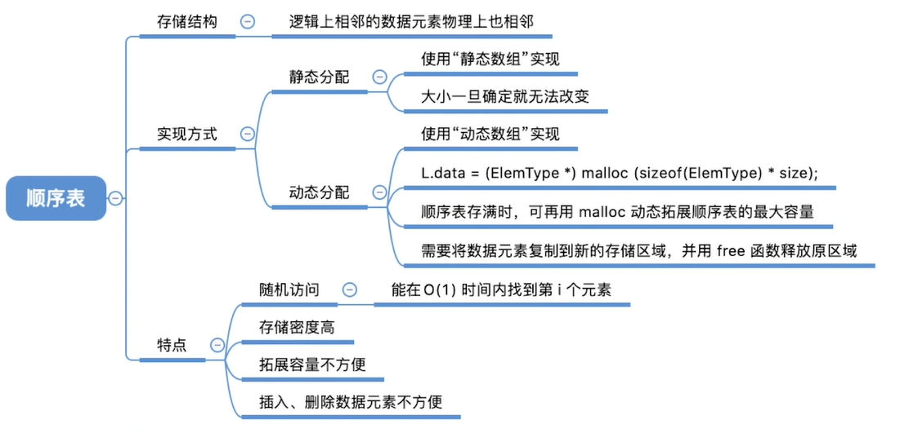

### 2.1 线性表的定义和基本操作

### 

#### 2.1.1 线性表的定义

线性表是具有相同数据类型的n(n>0)个数据元素的有限序列。
(其中n为表长，当n=0时线性表是一个空表。若用L命名线性表，则其一般表示为)

#####        特点：

1. 存在惟一的第一个元素。

2. 存在惟一的最后一个元素。

3. 除第一个元素之外，每个元素均只有一个直接前驱。

4. 除最后一个元素之外，每个元素均只有一个直接后继

  

  ##### 几个概念:

  1.ai是线性表中的“第i个”元素线性表中的位序。

  2.a1是表头元素;an是表尾元素。

  3.除第一个元素外，每个元素有且仅有一个直接前驱:除最后一个元素外，每个元素有且仅有一个直接后继。

  ##### 存储结构：

  1.顺序存储结构：顺序表

  2.链式存储结构：链表

  

  #### 2.1.2 线性表的基础操作

  1、InitList(&L)：初始化表。构造一个空的线性表L，分配内存空间。
  2、DestroyList(&L)： 销毁操作。销毁线性表，并释放线性表L所占用的内存空间。
  3、ListInsert(&L;i,e)：插入操作。在表L中的第i个位置上插入指定元素e。 
  4、ListDelete(&L,i,&e)：删除操作。删除表L中第i个位置的元素，并用e返回删除元素的值。
  5、LocateElem(L,e)：按值查找操作。在表L中查找具有给定关键字值的元素。
  6、GetElem(L,i): 按位查找操作。获取表L中第i个位置的元素的值。
  7、Length(L)：求表长。返回线性表L的长度，即L中数据元素的个数。
  8、PrintList(L)：输出操作。按前后顺序输出线性表L的所有元素值。
  9、Empty(L)：判空操作。若L为空表，则返回true，否则返回false。

**什么时候要传入参数的引用“&“-- 对参数的修改结果需要“带回来”看下面举例：**

- ```c
  首先是传值调用：
  
  #include<stdio.h>
  void test(int x)  //形参是实参的临时拷贝
  {
  	x = 1024;`
  	printf("test函数内部 x=%d\n",x);
  }
  int main()`
  {
  	int x = 1;
  	printf("调用test前 x=%d\n",x);
  	test(x);                       //这里的x改变了并没有传回来
  	printf("调用test后 x=%d\n",x);
  
  	return 0;
  
  }
  
  //输出为：
  //调用test前 x=1
  //test函数内部 x=1024
  //调用test后 x=1
  //请按任意键继续. . .
  ```

然后再看传址调用

```c
#include<stdio.h>
void test(int &x)  //把x的地址传到函数
{
	x = 1024;
	printf("test函数内部 x=%d\n",x);
}
int main()
{
	int x = 1;
	printf("调用test前 x=%d\n",x);
	test(x);                       //这里的x通过函数传回来值改变了
	printf("调用test后 x=%d\n",x);

	return 0;

}


//输出为：
//调用test前 x=1
//test函数内部 x=1024
//调用test后 x=1024
//请按任意键继续. . .
```


### 2.2 顺序表


**我们看完线性表的逻辑结构和基本运算，现在继续学习物理结构：顺序表** 


##### 2.2.1 顺序表的概念

###### 顺序表：用顺序存储的方式实现线性表顺序存储。把逻辑上相邻的元素存储在物理位置上也相邻的存储单元中，元素之间的关系由存储单元的邻接关系来体现。 

顺序表的特点：

1. ###### 随机访问，即可以在O(1)时间内找到第 i 个元素。

2. ###### 存储密度高，每个节点只存储数据元素。

3. ###### 拓展容量不方便（即使使用动态分配的方式实现，拓展长度的时间复杂度也比较高，因为需要把数据复制到新的区域）。

4. ###### 插入删除操作不方便，需移动大量元素：O(n).




- **顺序表的静态分配**
  顺序表的表长刚开始确定后就无法更改(存储空间是静态的)

  ```c
  //顺序表的实现--静态分配
  
  #include<stdio.h>
  #define MaxSize 10          //定义表的最大长度 
  typedef struct{
  	int data[MaxSize];      //用静态的"数组"存放数据元素
  	int length;             //顺序表的当前长度  
  }SqList;                    //顺序表的类型定义（静态分配方式） 
  void InitList(SqList &L){
  	 for(int i=0;i<MaxSize;i++){
  	 	L.data[i]=0;        //将所有数据元素设置为默认初始值
  		 }
  	 L.length=0;
  }
  int main(){
  	SqList L;               //声明一个顺序表
  	InitList(L);            //初始化一个顺序表
  	for(int i=0;i<MaxSize;i++){                //顺序表的打印
  		printf("data[%d]=%d\n",i,L.data[i]);
  	}
  	return 0; 
  }
  ```

  - **顺序表的动态分配**

```c
//顺序表的实现——动态分配
#include<stdio.h>
#include<stdlib.h>  //malloc、free函数的头文件 
#define InitSize 10 //默认的初始值

typedef struct{
	int  *data;    //指示动态分配数组的指针
	int MaxSize;   //顺序表的最大容量
	int length;    //顺序表的当前长度 
}SeqList; 

void InitList(SeqList &L){                 //初始化
	//用malloc 函数申请一片连续的存储空间
	L.data =(int*)malloc(InitSize*sizeof(int)) ;
	L.length=0;
	L.MaxSize=InitSize;
} 

void IncreaseSize(SeqList &L,int len){  //增加动态数组的长度
	int *p=L.data;
	L.data=(int*)malloc((L.MaxSize+len)*sizeof(int));
	for(int i=0;i<L.length;i++){
		L.data[i]=p[i];      //将数据复制到新区域 
	}
	L.MaxSize=L.MaxSize+len; //顺序表最大长度增加len
	free(p);                 //释放原来的内存空间 
	
} 
int main(){
	SeqList L;        //声明一个顺序表
	InitList(L);      //初始化顺序表
	IncreaseSize(L,5);//增加顺序表的长度
	return 0; 
}
```


#### 2.2.3 顺序表的基本操作


##### 1.顺序表的插入操作

###### ListInsert(&L,i,e)：插入操作。在表L中的第i个位置上插入指定元素e。

###### 平均时间复杂度 = O(n)

```c
#define MaxSize 10    //定义最大长度
typedef struct{
	int data[MaxSize];  //用静态的数组存放数据
	int length;         //顺序表的当前长度
}SqList;                //顺序表的类型定义  

bool ListInsert(SqList &L, int i, int e){ 
    if(i<1||i>L.length+1)    //判断i的范围是否有效
        return false;
    if(L.length>=MaxSize) //当前存储空间已满，不能插入  
        return false;

    for(int j=L.length; j>=i; j--){    //将第i个元素及其之后的元素后移
        L.data[j]=L.data[j-1];
    }
    L.data[i-1]=e;  //在位置i处放入e
    L.length++;      //长度加1
    return true;

}

int main(){ 
	SqList L;   //声明一个顺序表
	InitList(L);//初始化顺序表
	//...此处省略一些代码；插入几个元素

	ListInsert(L,3,3);   //再顺序表L的第三行插入3
	 
	return 0;

}
```


##### 2.顺序表的删除操作

###### ListDelete(&Li,&e): 删除操作。删除表L中第i个位置的元素，并用e返回删除元素的值。

```c
平均时间复杂度 = O(n)

#define MaxSize 10

typedef struct {
	int data[MaxSize];
	int length;
} SqList;

// 删除顺序表i位置的数据并存入e
bool ListDelete(SqList &L, int i, int &e) {
	if (i < 1 || i > L.length) // 判断i的范围是否有效
		return false;
	e = L.data[i-1]; // 将被删除的元素赋值给e 
	for (int j = i; j < L.length; j++) //将第i个位置后的元素前移 
		L.data[j-1] = L.data[j];
	L.length--;
	return true; 
}

int main() {
	SqList L;
	InitList(L);
	int e = -1;
	if (ListDelete(L, 3, e))
		printf("已删除第3个元素，删除元素值为%d\n", e);
	else
		printf("位序i不合法，删除失败\n"); 
	return 0; 
} 
```


##### 3.顺序表的查找


###### 顺序表的按位查找

GetElem(L,):按位查找操作。获取表L中第i个位置的元素的值

###### 平均时间复杂度O(1)

```c
// 静态分配的按位查找
#define MaxSize 10

typedef struct {
	ElemType data[MaxSize]; 
	int length;
}SqList;

ElemType GetElem(SqList L, int i) {
	return L.data[i-1];
}
// 动态分配的按位查找
#define InitSize 10

typedef struct {
	ElemType *data;
	int MaxSize;
	int length;
}SeqList;

ElemType GetElem(SeqList L, int i) {
	return L.data[i-1];
}
```

###### 顺序表的按值查找

LocateElem(L,e): 按值查找操作。在表L中查找具有给定关键字值的元素

###### 平均时间复杂度 =O(n)

```c
#define InitSize 10          //定义最大长度 
typedef struct{
    ElemTyp *data;           //用静态的“数组”存放数据元素 
    int Length;              //顺序表的当前长度
}SqList;   

//在顺序表L中查找第一个元素值等于e的元素，并返回其位序
int LocateElem(SqList L, ElemType e){
    for(int i=0; i<L.lengthl i++)
        if(L.data[i] == e)  
            return i+1;     //数组下标为i的元素值等于e，返回其位序i+1
    return 0;               //推出循环，说明查找失败
}
//调用LocateElem(L,9)
```


### 2.3 线性表的链式表示


##### 2.3.1. 单链表的基本概念

###### 单链表：用链式存储实现了线性结构。一个结点存储一个数据元素，各结点间的前后关系用一个指针表示。

特点：

##### 优点：不要求大片连续空间，改变容量方便。

##### 缺点：不可随机存取，要耗费一定空间存放指针。

> >两种实现方式：
> >1#带头结点，写代码更方便。头结点不存储数据，头结点指向的下一个结点才存放实际数据。
> >2#不带头结点，麻烦。对第一个数据结点与后续数据结点的处理需要用不同的代码逻辑，对空表和非空表的处理需要用不同的代码逻辑。
> >
> >```c
> >typedef struct LNode
> >{                      //定义单链表结点类型
> >ElemType data;     //数据域
> >struct LNode *next;//指针域
> >}LNode, *LinkList;
> >强调这是一个单链表--使用 LinkList
> >强调这是一个结点--使用 LNode* 
> >```
> >
> >


##### 2.3.2. 单链表的实现


```c
不带头节点
typedef struct LNode{
    ElemType data;
    struct LNode *next;
}LNode, *LinkList;

//初始化一个空的单链表
bool InitList(LinkList &L){
    L = NULL; //空表，暂时还没有任何结点
    return true;
}

void test(){
    LinkList L;  //声明一个指向单链表的头指针
    //初始化一个空表
    InitList(L);
    ...
}

//判断单链表是否为空
bool Empty(LinkList L){
    return (L==NULL)
}


```


~~~c
带头节点
typedef struct LNode
{
    ElemType data;
    struct LNode *next;
}LNode, *LinkList;

```
//初始化一个单链表（带头结点）
bool InitList(LinkList &L)
{  
    L = (LNode*) malloc(sizeof(LNode));  //头指针指向的结点——分配一个头结点（不存储数据）
    if (L == NULL)          //内存不足，分配失败
        return false;
    L -> next = NULL;       //头结点之后暂时还没有结点
    return true;
}

void test()
{
    LinkList L;  //声明一个指向单链表的指针: 头指针
    //初始化一个空表
    InitList(L);
    //...
}

//判断单链表是否为空（带头结点）
bool Empty(LinkList L)
{
    if (L->next == NULL)
        return true;
    else
        return false;
}
```


~~~

带头结点和不带头结点的比较：

不带头结点：写代码麻烦！对第一个数据节点和后续数据节点的处理需要用不同的代码逻辑，对空表和非空表的处理也需要用不同的代码逻辑; 头指针指向的结点用于存放实际数据;
带头结点：头指针指向的头结点不存放实际数据,头结点指向的下一个结点才存放实际数据;

##### 2.3.3. 单链表的插入


##### 按位序插入（带头结点）

```c
Listlnsert(&Li,e): 插入操作。在表L中的第i个位置上插入指定元素e
找到第i-1个结点(前驱结点)，将新结点插入其后；其中头结点可以看作第0个结点，故i=1时也适用。
平均时间复杂度:O(n)

typedef struct LNode
{
    ElemType data;
    struct LNode *next;
}LNode, *LinkList;

//在第i个位置插入元素e（带头结点）
bool ListInsert(LinkList &L, int i, ElemType e)
{  
    //判断i的合法性, i是位序号(从1开始)
    if(i<1)
        return False;
    

    LNode *p;       //指针p指向当前扫描到的结点 
    int j=0;        //当前p指向的是第几个结点
    p = L;          //L指向头结点，头结点是第0个结点（不存数据）
     
    //循环找到第i-1个结点
    while(p!=NULL && j<i-1){     //如果i>lengh, p最后会等于NULL
        p = p->next;             //p指向下一个结点
        j++;
    }
     
    if (p==NULL)                 //如果p指针知道最后再往后就是NULL
        return false;
    
    //在第i-1个结点后插入新结点
    LNode *s = (LNode *)malloc(sizeof(LNode)); //申请一个结点
    s->data = e;
    s->next = p->next;
    p->next = s;                 //将结点s连到p后,后两步千万不能颠倒qwq
     
    return true;

}
```


#####  按位序插入（不带头结点）

Listlnsert(&L,i,e): 插入操作。在表L中的第i个位置上插入指定元素e。将新结点插入其后;
因为不带头结点，所以不存在“第0个”结点，因此！i=1 时，需要特殊处理——插入(删除)第1个元素时，需要更改头指针L;

```c
typedef struct LNode
{
    ElemType data;
    struct LNode *next;
}LNode, *LinkList;

bool ListInsert(LinkList &L, int i, ElemType e)
{
    if(i<1)
        return false;
    

    //插入到第1个位置时的操作有所不同！
    if(i==1){
        LNode *s = (LNode *)malloc(size of(LNode));
        s->data =e;
        s->next =L;
        L=s;          //头指针指向新结点
        return true;
    }
     
    //i>1的情况与带头结点一样！唯一区别是j的初始值为1
    LNode *p;       //指针p指向当前扫描到的结点 
    int j=1;        //当前p指向的是第几个结点
    p = L;          //L指向头结点，头结点是第0个结点（不存数据）
     
    //循环找到第i-1个结点
    while(p!=NULL && j<i-1){     //如果i>lengh, p最后会等于NULL
        p = p->next;             //p指向下一个结点
        j++;
    }
     
    if (p==NULL)                 //i值不合法
        return false;
    
    //在第i-1个结点后插入新结点
    LNode *s = (LNode *)malloc(sizeof(LNode)); //申请一个结点
    s->data = e;
    s->next = p->next;
    p->next = s;          
    return true;

}
```

##### 指定结点的后插操作

InsertNextNode(LNode *p, ElemType e)；
给定一个结点p，在其之后插入元素e; 根据单链表的链接指针只能往后查找，故给定一个结点p，那么p之后的结点我们都可知，但是p结点之前的结点无法得知

```c
typedef struct LNode
{
    ElemType data;
    struct LNode *next;
}LNode, *LinkList;

bool InsertNextNode(LNode *p, ElemType e)
{
    if(p==NULL){
        return false;
    }

    LNode *s = (LNode *)malloc(sizeof(LNode));
    //某些情况下分配失败，比如内存不足
    if(s==NULL)
        return false;
    s->data = e;          //用结点s保存数据元素e 
    s->next = p->next;
    p->next = s;          //将结点s连到p之后
     
    return true;

}                         //平均时间复杂度 = O(1)


//有了后插操作，那么在第i个位置上插入指定元素e的代码可以改成：
bool ListInsert(LinkList &L, int i, ElemType e)
{  
    if(i<1)
        return False;
    

    LNode *p;       //指针p指向当前扫描到的结点 
    int j=0;        //当前p指向的是第几个结点
    p = L;          //L指向头结点，头结点是第0个结点（不存数据）
     
    //循环找到第i-1个结点
    while(p!=NULL && j<i-1){     //如果i>lengh, p最后4鸟会等于NULL
        p = p->next;             //p指向下一个结点
        j++;
    }
     
    return InsertNextNode(p, e)

}
```

##### 指定结点的前插操作

设待插入结点是s，将s插入到p的前面。我们仍然可以将s插入到*p的后面。然后将p->data与s->data交换，这样既能满足了逻辑关系，又能是的时间复杂度为O(1)

```c
//前插操作：在p结点之前插入元素e
bool InsertPriorNode(LNode *p, ElenType e){
    if(p==NULL)
        return false;
    

    LNode *s = (LNode *)malloc(sizeof(LNode));
    if(s==NULL) //内存分配失败
        return false;
     
    //重点来了！
    s->next = p->next;
    p->next = s;       //新结点s连到p之后
    s->data = p->data; //将p中元素复制到s
    p->data = e;       //p中元素覆盖为e
     
    return true；

} 
```

##### 2.3.4. 单链表的删除

按位序删除节点
ListDelete(&L, i, &e): 删除操作，删除表L中第i个位置的元素，并用e返回删除元素的值;头结点视为“第0个”结点；
思路：找到第i-1个结点，将其指针指向第i+1个结点，并释放第i个结点

```c
typedef struct LNode{
    ElemType data;
    struct LNode *next;
}LNode, *LinkList;

bool ListDelete(LinkList &L, int i, ElenType &e){
    if(i<1) return false;

    LNode *p;       //指针p指向当前扫描到的结点 
    int j=0;        //当前p指向的是第几个结点
    p = L;          //L指向头结点，头结点是第0个结点（不存数据）
     
    //循环找到第i-1个结点
    while(p!=NULL && j<i-1){     //如果i>lengh, p最后会等于NULL
        p = p->next;             //p指向下一个结点
        j++;
    }
     
    if(p==NULL) 
        return false;
    if(p->next == NULL) //第i-1个结点之后已无其他结点
        return false;
     
    LNode *q = p->next;         //令q指向被删除的结点
    e = q->data;                //用e返回被删除元素的值
    p->next = q->next;          //将*q结点从链中“断开”
    free(q)                     //释放结点的存储空间
     
    return true;

}


```

#####  指定结点的删除

```c
bool DeleteNode(LNode *p){
    if(p==NULL)
        return false;
    

    LNode *q = p->next;      //令q指向*p的后继结点
    p->data = p->next->data; //让p和后继结点交换数据域
    p->next = q->next;       //将*q结点从链中“断开”
    free(q);
    return true;

} //时间复杂度 = O(1)
```


#### 2.3.5. 单链表的查找


单链表的按位查找
GetElem(L, i): 按位查找操作，获取表L中第i个位置的元素的值;
平均时间复杂度O(n)

```c
LNode * GetElem(LinkList L, int i){
    if(i<0) return NULL;
    

    LNode *p;               //指针p指向当前扫描到的结点
    int j=0;                //当前p指向的是第几个结点
    p = L;                  //L指向头结点,头结点是第0个结点(不存数据)
    while(p!=NULL && j<i){  //循环找到第i个结点
        p = p->next;
        j++;
    }
     
    return p;               //返回p指针指向的值

}
```


单链表的按值查找
LocateElem(L, e):按值查找操作，在表L中查找具有给定关键字值的元素;
平均时间复杂度:O(n)

```c
LNode * LocateElem(LinkList L, ElemType e){
    LNode *P = L->next;    //p指向第一个结点
    //从第一个结点开始查找数据域为e的结点
    while(p!=NULL && p->data != e){
        p = p->next;
    }
    return p;           //找到后返回该结点指针，否则返回NULL
}


```


求单链表的长度
Length(LinkList L)：计算单链表中数据结点（不含头结点）的个数，需要从第一个结点看是顺序依次访问表中的每个结点。
算法的时间复杂度为O(n)

```c
int Length(LinkList L){
    int len=0;       //统计表长
    LNode *p = L;
    while(p->next != NULL){
        p = p->next;
        len++;
    }
    return len;
}
```

2.3.6. 单链表的建立

Step 1:初始化一个单链表
Step 2:每次取一个数据元素，插入到表尾/表头

#### 尾插法建立单链表

平均时间复杂度O(n)

思路：每次将新节点插入到当前链表的表尾，所以必须增加一个尾指针r,使其始终指向当前链表的尾结点。好处：生成的链表中结点的次序和输入数据的顺序会一致。

```c
// 使用尾插法建立单链表L
LinkList List_TailInsert(LinkList &L){   
    int x;			//设ElemType为整型int  
    L = (LinkList)malloc(sizeof(LNode));     //建立头结点(初始化空表)     
    LNode *s, *r = L;                        //r为表尾指针    
    scanf("%d", &x);                         //输入要插入的结点的值   
    while(x!=9999){                          //输入9999表示结束     
        s = (LNode *)malloc(sizeof(LNode));    
        s->data = x;           
        r->next = s;           
        r = s;                               //r指针指向新的表尾结点     
        scanf("%d", &x);       
    }    
    r->next = NULL;                          //尾结点指针置空      
    return L;
}
```

头插法建立单链表
平均时间复杂度O(n)

```c
LinkList List_HeadInsert(LinkList &L){       //逆向建立单链表
    LNode *s;
    int x;
    L = (LinkList)malloc(sizeof(LNode));     //建立头结点
    L->next = NULL;                          //初始为空链表,这步不能少！

    scanf("%d", &x);                         //输入要插入的结点的值
    while(x!=9999){                          //输入9999表结束
        s = (LNode *)malloc(sizeof(LNode));  //创建新结点
        s->data = x;
        s->next = L->next;
        L->next = s;                         //将新结点插入表中，L为头指针
        scanf("%d", &x);   
    }
    return L;

}
```

##### 链表的逆置

算法思想：逆置链表初始为空，原表中结点从原链表中依次“删除”，再逐个插入逆置链表的表头（即“头插”到逆置链表中），使它成为逆置链表的“新”的第一个结点，如此循环，直至原链表为空；

```c
LNode *Inverse(LNode *L)
{
	LNode *p, *q;
	p = L->next;     //p指针指向第一个结点
	L->next = NULL;  //头结点指向NULL

	while (p != NULL){
		q = p;
		p = p->next;
		q->next = L->next;  
		L->next = q;
	}
	return L;


```

2.3.7. 双链表


双链表中节点类型的描述

```c
typedef struct DNode{            //定义双链表结点类型
    ElemType data;               //数据域
    struct DNode *prior, *next;  //前驱和后继指针
}DNode, *DLinklist;

双链表的初始化（带头结点）
typedef struct DNode{            //定义双链表结点类型
    ElemType data;               //数据域
    struct DNode *prior, *next;  //前驱和后继指针
}DNode, *DLinklist;

//初始化双链表
bool InitDLinkList(Dlinklist &L){
    L = (DNode *)malloc(sizeof(DNode));      //分配一个头结点
    if(L==NULL)                              //内存不足，分配失败
        return false;
    

    L->prior = NULL;   //头结点的prior指针永远指向NULL
    L->next = NULL;    //头结点之后暂时还没有结点
    return true;

}

void testDLinkList(){
    //初始化双链表
    DLinklist L;         // 定义指向头结点的指针L
    InitDLinkList(L);    //申请一片空间用于存放头结点，指针L指向这个头结点
    //...
}

//判断双链表是否为空
bool Empty(DLinklist L){
    if(L->next == NULL)    //判断头结点的next指针是否为空
        return true;
    else
        return false;
}
```

#### 双链表的插入操作

##### 后插操作

```c
InsertNextDNode(p, s): 在p结点后插入s结点
bool InsertNextDNode(DNode *p, DNode *s){ //将结点 *s 插入到结点 *p之后
    if(p==NULL || s==NULL) //非法参数
        return false;
    

    s->next = p->next;
    if (p->next != NULL)   //p不是最后一个结点=p有后继结点  
        p->next->prior = s;
    s->prior = p;
    p->next = s;
    
    return true;

}
```


#### 双链表的删除操作

###### 删除p节点的后继节点

```c
//删除p结点的后继结点
bool DeletNextDNode(DNode *p){
    if(p==NULL) return false;
    DNode *q =p->next;            //找到p的后继结点q
    if(q==NULL) return false;     //p没有后继结点;
    p->next = q->next;
    if(q->next != NULL)           //q结点不是最后一个结点
        q->next->prior=p;
    free(q);

    return true;

}
```

##### //销毁一个双链表

```c
bool DestoryList(DLinklist &L){
    //循环释放各个数据结点
    while(L->next != NULL){
        DeletNextDNode(L);  //删除头结点的后继结点
    free(L); //释放头结点
    L=NULL;  //头指针指向NULL

    }

}
```

#### 双链表的遍历操作

##### 前向遍历

```c
while(p!=NULL){
    //对结点p做相应处理，eg打印
    p = p->prior;
}
后向遍历

while(p!=NULL){
    //对结点p做相应处理，eg打印
    p = p->next;
}
```

注意：双链表不可随机存取，按位查找和按值查找操作都只能用遍历的方式实现，时间复杂度为O(n)


## 2.3.8. 循环链表

循环单链表
最后一个结点的指针不是NULL,而是指向头结点

```c
typedef struct LNode{            
    ElemType data;               
    struct LNode *next;  
}DNode, *Linklist;

/初始化一个循环单链表
bool InitList(LinkList &L){
    L = (LNode *)malloc(sizeof(LNode)); //分配一个头结点
    if(L==NULL)             //内存不足，分配失败
        return false;
    L->next = L;            //头结点next指针指向头结点
    return true;
}

//判断循环单链表是否为空（终止条件为p或p->next是否等于头指针）
bool Empty(LinkList L){
    if(L->next == L)
        return true;    //为空
    else
        return false;
}

//判断结点p是否为循环单链表的表尾结点
bool isTail(LinkList L, LNode *p){
    if(p->next == L)
        return true;
    else
        return false;
}
```

单链表和循环单链表的比较：
★
★
单链表：从一个结点出发只能找到该结点后续的各个结点；对链表的操作大多都在头部或者尾部；设立头指针，从头结点找到尾部的时间复杂度=O(n)，即对表尾进行操作需要O(n)的时间复杂度;
★
★
循环单链表：从一个结点出发，可以找到其他任何一个结点；设立尾指针，从尾部找到头部的时间复杂度为O(1)，即对表头和表尾进行操作都只需要O(1)的时间复杂度;
★
★
循环单链表优点：从表中任一节点出发均可找到表中其他结点。

循环双链表 
表头结点的prior指向表尾结点，表尾结点的next指向头结点
typedef struct DNode{          
    ElemType data;               
    struct DNode *prior, *next;  
}DNode, *DLinklist;

//初始化空的循环双链表
bool InitDLinkList(DLinklist &L){
    L = (DNode *) malloc(sizeof(DNode));    //分配一个头结点
    if(L==NULL)            //内存不足，分配失败
        return false;  
    L->prior = L;          //头结点的prior指向头结点
    L->next = L;           //头结点的next指向头结点
}

void testDLinkList(){
    //初始化循环单链表
    DLinklist L;
    InitDLinkList(L);
    //...
}

//判断循环双链表是否为空
bool Empty(DLinklist L){
    if(L->next == L)
        return true;
    else
        return false;
}

//判断结点p是否为循环双链表的表尾结点
bool isTail(DLinklist L, DNode *p){
    if(p->next == L)
        return true;
    else
        return false;
}


循环链表的插入
bool InsertNextDNode(DNode *p, DNode *s){ 
    s->next = p->next;
    p->next->prior = s;
    s->prior = p;
    p->next = s;
循环链表的删除
//删除p的后继结点q
p->next = q->next;
q->next->prior = p;
free(q);
2.3.9. 静态链表


单链表：各个结点散落在内存中的各个角落，每个结点有指向下一个节点的指针(下一个结点在内存中的地址);

静态链表：用数组的方式来描述线性表的链式存储结构: 分配一整片连续的内存空间，各个结点集中安置，包括了——数据元素and下一个结点的数组下标(游标)

静态链表用代码表示
#define MaxSize 10        //静态链表的最大长度

struct Node{              //静态链表结构类型的定义
    ElemType data;        //存储数据元素
    int next;             //下一个元素的数组下标(游标)
};

//用数组定义多个连续存放的结点
void testSLinkList(){
    struct Node a[MaxSize];  //数组a作为静态链表, 每一个数组元素的类型都是struct Node
    //...
}
或者是：

#define MaxSize 10        //静态链表的最大长度

typedef struct{           //静态链表结构类型的定义
    ELemType data;        //存储数据元素
    int next;             //下一个元素的数组下标
}SLinkList[MaxSize];

void testSLinkList(){
    SLinkList a;
}
相当于：

#define MaxSize 10        //静态链表的最大长度

struct Node{              //静态链表结构类型的定义
    ElemType data;        //存储数据元素
    int next;             //下一个元素的数组下标(游标)
};

typedef struct Node SLinkList[MaxSize]; //重命名struct Node，用SLinkList定义“一个长度为MaxSize的Node型数组;


2.3.10. 顺序表和链表的比较
【逻辑结构】

顺序表和链表都属于线性表，都是线性结构
【存储结构】

顺序表：顺序存储

优点：支持随机存取，存储密度高
缺点：大片连续空间分配不方便，改变容量不方便
链表：链式存储

优点：离散的小空间分配方便，改变容量方便
缺点：不可随机存取，存储密度低
【基本操作 - 创建】

顺序表：需要预分配大片连续空间。若分配空间过小，则之后不方便拓展容量；若分配空间过大，则浪费内存资源；
静态分配：静态数组，容量不可改变
动态分配：动态数组，容量可以改变，但是需要移动大量元素，时间代价高（malloc(),free()）
链表：只需要分配一个头结点或者只声明一个头指针
【基本操作 - 销毁】

静态数组——系统自动回收空间
动态分配：动态数组——需要手动free()
【基本操作-增/删】

顺序表：插入/删除元素要将后续元素后移/前移；时间复杂度=O(n)，时间开销主要来自于移动元素；

链表：插入/删除元素只需要修改指针；时间复杂度=O(n)，时间开销主要来自查找目标元素

【基本操作-查】

顺序表

按位查找：O(1)
按值查找：O(n)，若表内元素有序，可在O(log2n)时间内找到
链表

按位查找：O(n)
按值查找：O(n)
顺序、链式、静态、动态四种存储方式的比较
顺序存储的固有特点：

逻辑顺序与物理顺序一直，本质上是用数组存储线性表的各个元素（即随机存取）；存储密度大，存储空间利用率高。
链式存储的固有特点：

元素之间的关系采用这些元素所在的节点的“指针”信息表示（插、删不需要移动节点）。
静态存储的固有特点：

在程序运行的过程中不要考虑追加内存的分配问题。
动态存储的固有特点：

可动态分配内存；有效的利用内存资源，使程序具有可扩展性。


